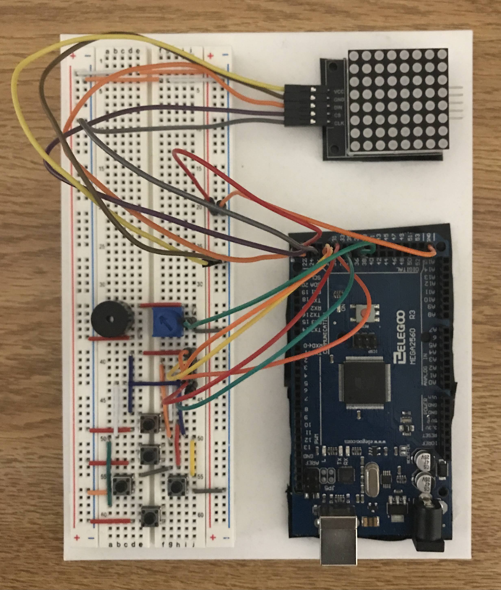

# Portable Games

Codebase that uses a model-view-controller design for developing simple pixel games (i.e. Snake,
Tetris) which can compile on both an Arduino using a dot matrix display and on a Linux machine using
Qt.

## Arduino Setup

* MAX7219 dot matrix display connected to Arduino's 5V and ground rails, with control wires
  connected to digital I/O pins
* Passive piezo buzzer connected to digital I/O pin and ground through a potentiometer
* Five buttons connected to digital I/O pins and ground, with resistance provided by internal
  pull-up resistors on the Arduino
  
## Milestones

- [x] Implement general model, view, and controller headers 
- [x] Implement controller, should be capable of running any given model
- [x] Implement display and sound for the Arduino
- [x] Implement a model for Snake
- [ ] Implement display and sound for Linux using Qt
- [ ] Implement models for Tetris and a Zelda-like adventure game
